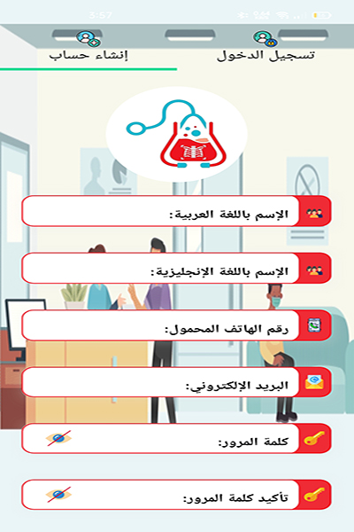

<h1 align="center">SMC-Al Elizeh (API - C#)</h1>

website                                           |Logo|
:------------------------------------------:      |:--:
[Admins egypt](https://admins-egypt.adminssw.com/)|
 

 
|         System code             | Platform | Programming Language  |Logo|
|:-------------------------------:|:--------:|:---------------------:|:--:|
|**SMC** => `Smart Medical System`|  `Api`   |        **C#**         |

## 🎯Target
Providing comprehensive health services of international 
quality according to modern technology methods 
to contribute to the development of the 
health system, through a qualified team using
the best modern and advanced equipment and the latest
scientific knowledge to serve our patients, alleviate their suffering
and achieve their satisfaction within a framework of mutual trust
and shared moral values in accordance with the
highest quality standards. Globalism.

## 👀Vision
To become a leading and reference center for 
health care, education and medical training,
distinguished by providing various integrated medical and 
health services to serve all segments of society, and to be a
role model in providing comprehensive health
services based on the application of quality standards.

## ⁉Why use this application?
An integrated system for managing clinics and medical 
centers with an easy-to-use interface that supports the Arabic
language, where you can issue electronic bills for the 
provided health services, medicines and medical supplies,
follow-up patients, record their patients’ history,
the development of their health condition,
and the extent of their commitment to the relevant instructions
, with accurate organization of the dates of
statements and operations, and the appointment of
doctors to patients, And sending reminders of their appointments
, whether to patients or medical staff through automated
transmission rules, in addition to the possibility of activating the benefits of medical insurance for customers, registering contracted insurance companies, applying insurance and discount rates and collecting them from medical insurance companies, as well as professional management of public accounts within your medical center with advanced tools that allow the issuance of reports
Detailed including profit and loss reports.

## 🔩Who needs this app
Medical clinics that contain a number from 1 to 500 employees, a doctor or a private clinic, a number of patients from 1 to 100,000, and a large number of accounts and specializations

## 🚫What is setting limits?
 **number of branches : 1**

 **number of specialties : 8**

 **number of employees : ∞**

## ⚡Features / What does it cover ? 
*  News 
*  Offers 
*  Offers  Reservations *(notification on all cycle to client and parent client)* 
  * Reservations 
  * Reservations pending  
  * Reservations current 
  * Reservations in Center 
  * Reservations in Service 
  * Reservations awaiting entry again
  * Reservations Finshed 
  * Reservations awaiting acceptance of cancellation 
  * Reservations cancel before approval
  * Reservations cancel after approval 
  
*  Reservations Following (Same Cycle Reservations) 
*  Reservations Payments and billing
*  Reservations services 
*  Historical plans 
  * Historical diagnosis
  * Historical medication
  * Historical measurement
  * Historical rays
  * Historical analyzes 
  * Historical addictive diseases
  * Historical addictive habits
  * Historical operations
  * Historical medical alerts
  * Historical cure plans
  * Historical doctor notes
  * Historical question plans

*  Wallets
*  Points
*  Accounts
  * Accounts
  * Accounts transactions
  * Accounts revenues
  * Accounts expenses

*  Patients *(Complete and detailed data exceeding 90 digits to be filled in as desired)*
*  Employees *(Complete and detailed data exceeding 90 digits to be filled in as desired)*
  * Employees 
  * Employees Privilege 

*  Branches
  * Branches Buildings 
  * Branches Floors
  * Branches Chambers
  * Branches Offices
  * Branches Offices Times
  * Branches Floors 
  
*  Reports
  * Report accounts transactions
  * Report reservations
  * Report payments
*  Fully statistics
*  App Settings
  * Sectors 
  * Jobs
  * Qualifications
  * Revenues types
  * Expenses types
  * News categories
  * General specialties
  * Special specialties
  * Services types
  * Services
  * Medicines types
  * Medicines
  * Rays
  * Analysis
  * Blood types
  * Method paids
  * Scientific degrees
  * Countries
  * Governates
  * Cities
  * Districts
  * Insurance companies
  * Body anatomy types
  * Body anatomies
  * Surgeries
  * Meals types
  * Meals
  * Active substances
  * Questions types
  * Questions
  * Addictive diseases
  * Addictive habits

## Feedback
If you have any feedback, please reach out to us at ahmedabdelkreem@adminssw.com
## Screenshots

<table style="border:1px solid black;margin-left:auto;margin-right:auto;">
  <tr>
    <td></td>
    <td></td>
    <td></td>
  </tr>
    <tr>
    <td></td>
    <td></td>
    <td></td>
  </tr>
 </table>

# SMC
